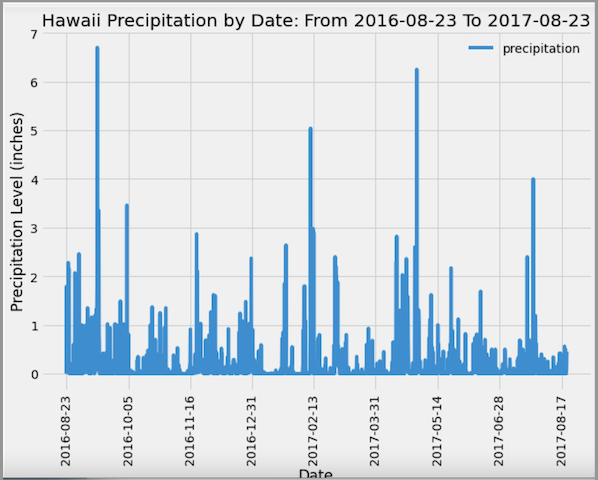
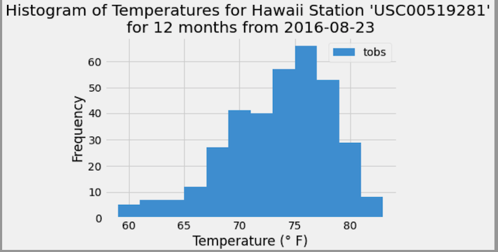
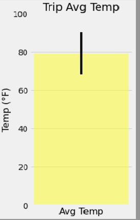
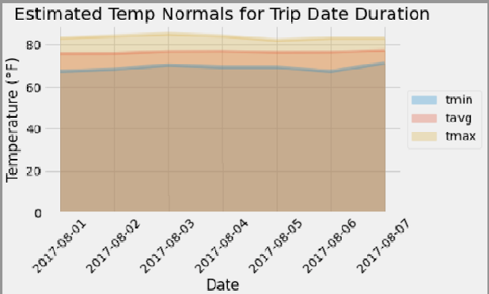

# sqlalchemy_challenge
Jupyter notebook, sqlite, sqlalchemy, json, to analyze weather data

### Surfs Up!
Treat yourself to a long holiday vacation in Honolulu, Hawaii! To help with your trip planning, you need to do some climate analysis on the area. 

### Setup
1. Created a new repository for this project called `sqlalchemy-challenge`. 

2. Cloned the new repository to your computer.

3. Added Jupyter notebook and `app.py` to this folder. These are  the main scripts to run for analysis.

4. Pushed the above changes to GitHub or GitLab.

5. All resources are in the Resources folder.

## Step 1 - Climate Analysis and Exploration

Used Python and SQLAlchemy to do basic climate analysis and data exploration of the climate database. Most of the analysis was completed using SQLAlchemy ORM queries, Pandas, and Matplotlib.

* Used the  [starter notebook](climate_starter.ipynb) and [hawaii.sqlite](Resources/hawaii.sqlite) files to complete the climate analysis and data exploration.

* Used SQLAlchemy `create_engine` to connect to hawaii sqlite database.

* Used SQLAlchemy `automap_base()` to reflect the tables into classes and saved a reference to those classes called `Station` and `Measurement`.

* Linked Python to the database by creating an SQLAlchemy session.

### Precipitation Analysis

* Started by finding the most recent date in the data set.

* Used this date, to retrieve the last 12 months of precipitation data by querying the 12 preceding months of data. 

* Selected only the `date` and `prcp` values.

* Loaded the query results into a Pandas DataFrame and set the index to the date column.

* Sorted the DataFrame values by `date`.

* Plotted the results using the DataFrame `plot` method.

  

* Used Pandas to print the summary statistics for the precipitation data.

### Station Analysis

* Designed a query to calculate the total number of stations in the dataset.

* Designed a query to find the most active stations (i.e. which stations have the most rows).

  * Listed the stations and observation counts in descending order.

  * Found the station id that has the highest number of observations.

  * Used the most active station id, calculated the lowest, highest, and average temperature.

  * Used a function as `func.min`, `func.max`, `func.avg`, and `func.count` in the queries.

* Designed a query to retrieve the last 12 months of temperature observation data (TOBS).

  * Filtered by the station with the highest number of observations.

  * Queried the last 12 months of temperature observation data for this station.

  * Plotted the results as a histogram with `bins=12`.

    

* Closed out your session.

## Step 2 - Climate App

Designed a Flask API based on the queries developed.

* Used Flask to create routes.

### Routes

* `/`

  * Home page.

  * Listed all routes available.

* `/api/v1.0/precipitation`

  * Converted the query results to a dictionary using `date` as the key and `prcp` as the value.

  * Returned the JSON representation of the dictionary.

* `/api/v1.0/stations`

  * Returned a JSON list of stations from the dataset.

* `/api/v1.0/tobs`
  * Queried the dates and temperature observations of the most active station for the last year of data.

  * Returned a JSON list of temperature observations (TOBS) for the previous year.

* `/api/v1.0/<start>` and `/api/v1.0/<start>/<end>`

  * Returned a JSON list of the minimum temperature, the average temperature, and the max temperature for a given start or start-end range.

  * When given the start only, calculated `TMIN`, `TAVG`, and `TMAX` for all dates greater than and equal to the start date.

  * When given the start and the end date, calculated the `TMIN`, `TAVG`, and `TMAX` for dates between the start and end date inclusive.
  
  ## Other Analyses

  * Used the  [temp_analysis_bonus_1_starter.ipynb](temp_analysis_bonus_1_starter.ipynb) and [temp_analysis_bonus_2_starter](temp_analysis_bonus_2_starter.ipynb) starter notebooks for each further analyses.  
  
  ### Temperature Analysis I

  * Hawaii is reputed to enjoy mild weather all year. Is there a meaningful difference between the temperature in, for example, June and December?

  * Used pandas to perform this portion.

    * Converted the date column format from string to datetime.

    * Set the date column as the DataFrame index

    * Tested dropping the date column

  * Identified the average temperature in June at all stations across all available years in the dataset. Did the same for December temperature.

  * Used the t-test to determine whether the difference in the means, if any, is statistically significant. Used an unpaired t-test
  
  ### Temperature Analysis II

  * Take a trip from August first to August seventh of 2021, but are worried that the weather will be less than ideal. Used historical data in the dataset find out what the temperature had previously looked like.

  * The starter notebook used a function called `calc_temps` that accepted a start date and end date in the format `%Y-%m-%d`. The function returned the minimum, average, and maximum temperatures for that range of dates.

  * Used the `calc_temps` function to calculate the min, avg, and max temperatures for the trip using the matching dates from a previous year (i.e., use "2017-08-01").

  * Ploted the min, avg, and max temperature from previous query as a bar chart.

    * Used "Trip Avg Temp" as the title.

    * Used the average temperature as the bar height (y value).

    * Used the peak-to-peak (TMAX-TMIN) value as the y error bar (YERR).

      

### Daily Rainfall Average

* Checked to see what the rainfall has been. (Don't want rain the whole time!)

* Calculated the rainfall per weather station using the previous year's matching dates.

  * Sorted this in descending order by precipitation amount and listed the station, name, latitude, longitude, and elevation.
  
  ### Daily Temperature Normals

  * Calculated the daily normals for the duration of the trip. Normals are the averages for the min, avg, and max temperatures. Used a function called `daily_normals` that calculated the daily normals for a specific date. This date string is in the format `%m-%d`. Used all historic TOBS that match that date string.

    * Set the start and end date of the trip.

    * Used the date to create a range of dates.

    * Stripped off the year and save a list of strings in the format `%m-%d`.

    * Used the `daily_normals` function to calculate the normals for each date string and append the results to a list called `normals`.

  * Loaded the list of daily normals into a Pandas DataFrame and set the index equal to the date.

  * Used Pandas to plot an area plot (`stacked=False`) for the daily normals.

    

  * Close out your session.
  
  - - -

  ## References

  Menne, M.J., I. Durre, R.S. Vose, B.E. Gleason, and T.G. Houston, 2012: An overview of the Global Historical Climatology Network-Daily Database. Journal of Atmospheric and Oceanic Technology, 29, 897-910, [https://doi.org/10.1175/JTECH-D-11-00103.1](https://doi.org/10.1175/JTECH-D-11-00103.1)

  - - -

  © 2021 Trilogy Education Services, LLC, a 2U, Inc. brand. Confidential and Proprietary. All Rights Reserved.
